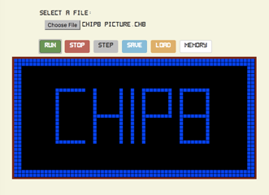

# chip-8-emulator

> A CHIP-8 emulator written in Javascript

## Introduction

The CHIP-8 Emulator program simulates a CHIP-8 environment to run programs written in this language Chip-8 is a simple, interpreted, programming language which was first used on some do-it-yourself computer systems in the late 1970s and early 1980s.

The emulator consists of a screen which simulates a monitor connected to machines running CHIP-8.

Also, there are several buttons which provide different functionalities such as loading a file into the memory of the emulator, executing the program or even to pause or save/load the current state of the running machine.

There is a debugging environment which provides and overview of the register values and memory content of the machine.

## References

1. https://en.wikipedia.org/wiki/CHIP-8
2. http://www.multigesture.net/articles/how-to-write-an-emulator-chip-8-interpreter/
3. http://devernay.free.fr/hacks/chip8/C8TECH10.HTM
4. http://mattmik.com/files/chip8/mastering/chip8.html
